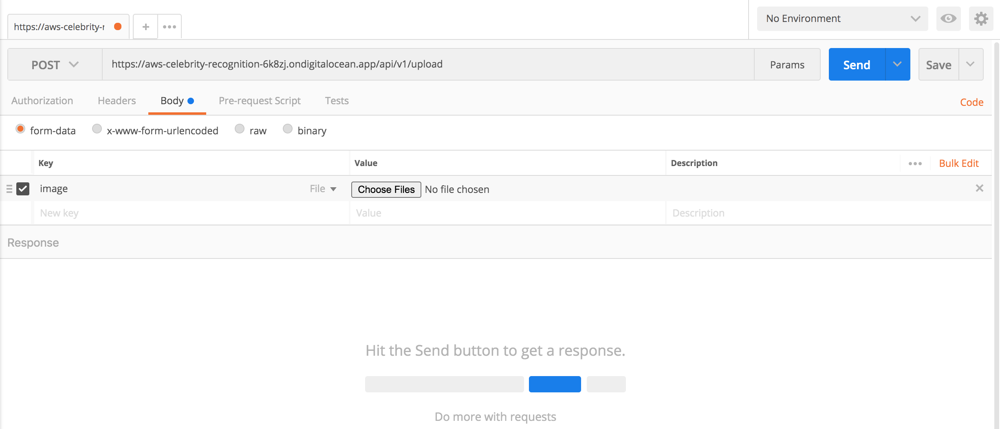
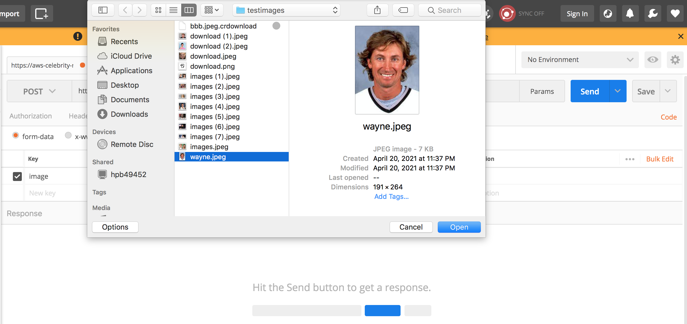
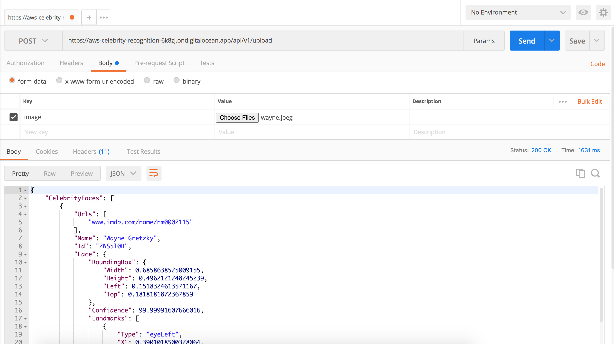
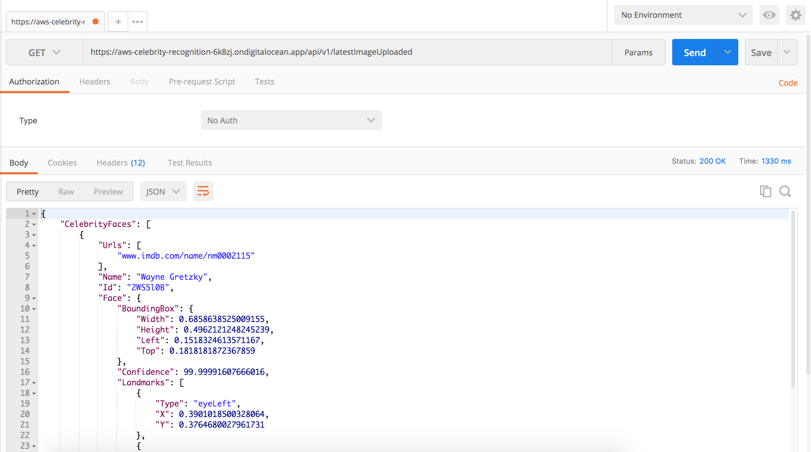
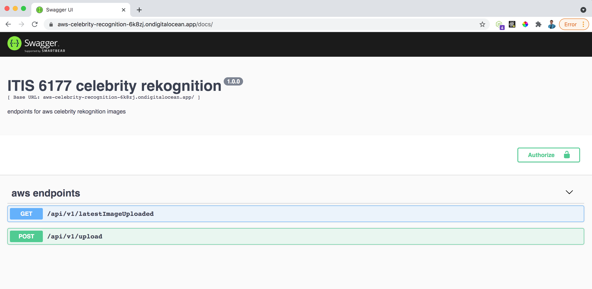
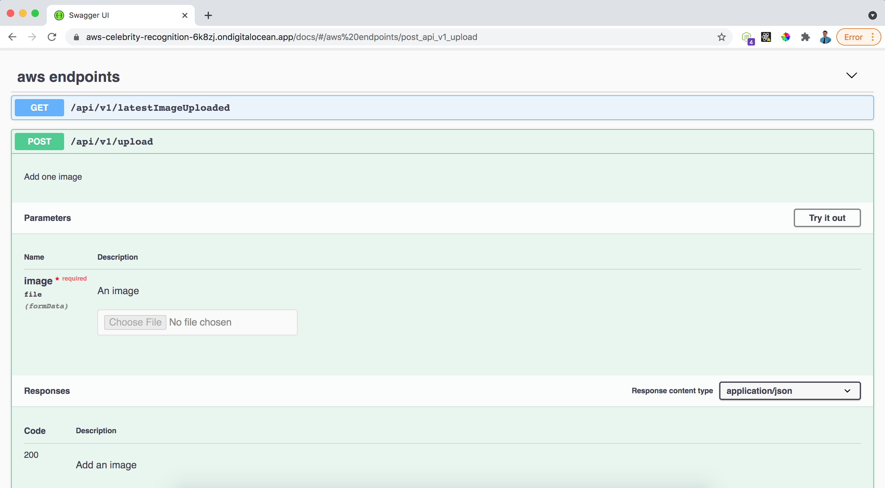
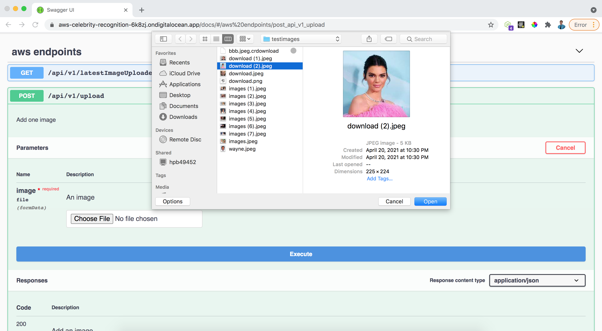
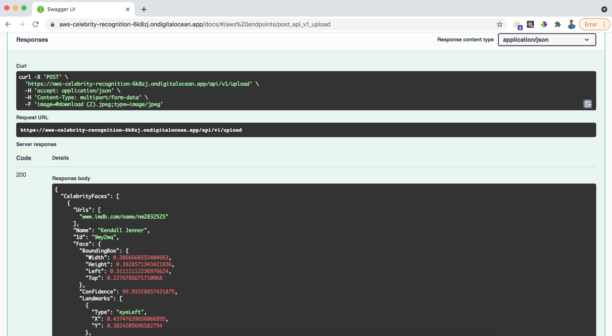
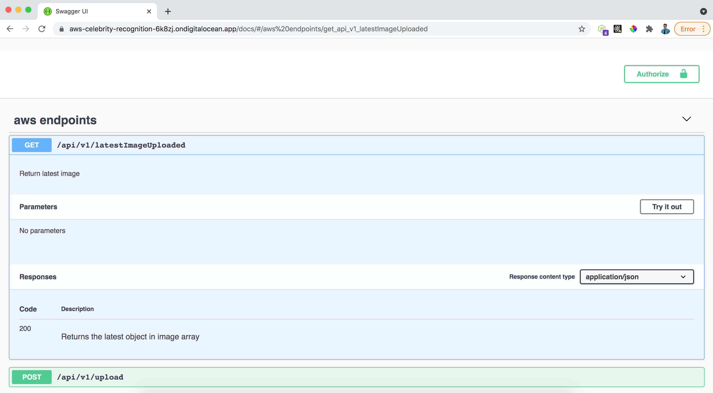
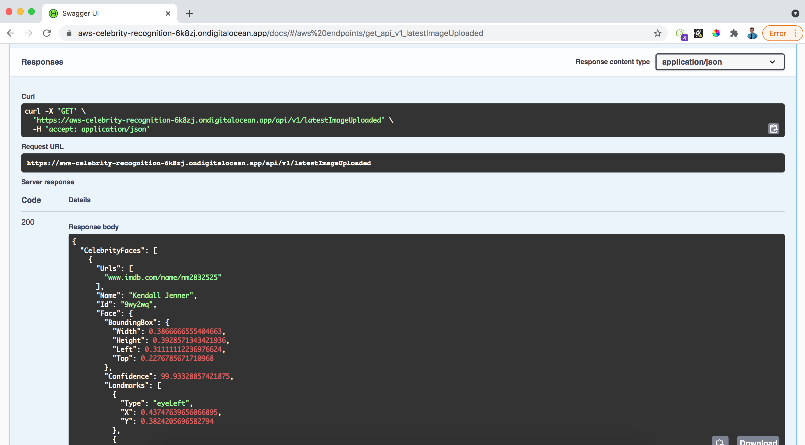

# aws-celebrity-recognition

## ITIS 6177 - aws celebrity recognition

An API developed to allow users to simply upload an image, and get a response of if there is a celebrity in it or not, as well as who the celebrity is and data about the celebrity.

## How to use

There are multiple ways to interact with this API. Below I will describe and show screenshots of the following ways

- 1. Postman
- 2. Swagger Docs

### Postman

Open postman, toggle your CRUD action to make a `POST` request and the url endpoint as `https://aws-celebrity-recognition-6k8zj.ondigitalocean.app/api/v1/upload`
Select the `Body` tab, then select `form-data`.
For the key, type in `image`. In the dropdown for the key, select `File`.

Click `Choose files` for the value, select an image file

Click `Send` to send the post request. If you chose a jpg, jpeg or png and it is above a certain size, it will be uploaded and you should receive a response.

If you want to get the latest image added, toggle your CRUD action to make a `GET` request and change the url endpoint to `https://aws-celebrity-recognition-6k8zj.ondigitalocean.app/api/v1/latestImageUploaded`.

Click `Send` and returned will be the last image uploaded.

### Swagger Docs

- 1. Navigate to the [API Swagger Docs](https://aws-celebrity-recognition-6k8zj.ondigitalocean.app/docs/)

See the two endpoints, one `GET` endpoint, one `POST` endpoint

Select the `POST` endpoint for `/api/v1/upload` and click `Try it out`

Choose a file to upload and click `Execute`.

If you chose a jpg, jpeg or png and it is above a certain size, it will be uploaded and you should receive a response.

Open the `GET` endpoint `/api/v1/latestImageUploaded`

Click `Try it out` and then `Execute`

See the last uploaded image response

AWS Celebrity Rekognition has many forms of [rekognition](https://aws.amazon.com/rekognition/?p=ft&c=ml&t=149&blog-cards.sort-by=item.additionalFields.createdDate&blog-cards.sort-order=desc). More info on specific celebrity Rekognition can be found [here](https://docs.aws.amazon.com/rekognition/latest/dg/celebrities.html)
